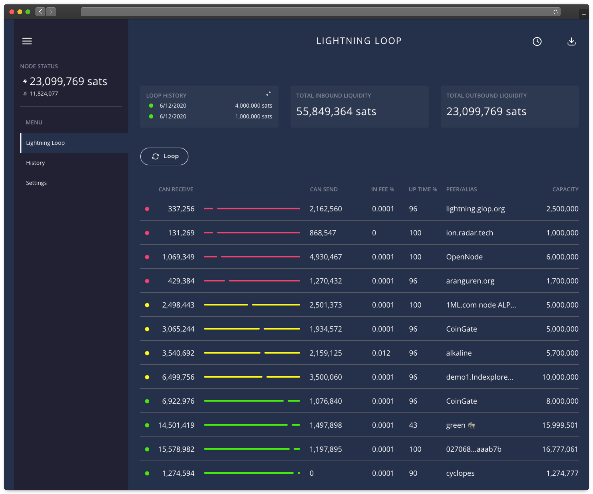

# Lightning Terminal (LiT)


Lightning Terminal (LiT) is a browser-based interface for managing channel liquidity.



## Features
- Visualize your channels and balances
- Perform submarine swaps via the [Lightning Loop](https://lightning.engineering/loop) service
- Classify channels according to your node's operating mode
- Run a single binary that integrates [`loopd`](https://github.com/lightninglabs/loop),
  [`poold`](https://github.com/lightninglabs/pool) and
  [`faraday`](https://github.com/lightninglabs/faraday) daemons all in one
- Access a preview release of the Pool UI
- Use Pool to earn sats by opening channels to those needing inbound liquidity

## Installation
Download the latest binaries from the [releases](https://github.com/lightninglabs/lightning-terminal/releases) page. 

Additionally, you can find detailed instructions on the [docs.lightning.engineering](https://docs.lightning.engineering/lightning-network-tools/lightning-terminal/get-lit) page.

## Execution
Run Lightning Terminal with a local `lnd` instance:

```shell
⛰  ./litd --uipassword=UP48lm4Vjqxy<change_this_or_you_will_get_robbed>
```

Visit https://localhost:8443 to access Terminal.

Note that a password with a minimum of 8 characters is required to run Lightning Terminal. In a production environment, it's recommended that you store this password as an environment variable to avoid it being recorded in the command history.

To use LiT with a remote `lnd` instance please [follow these instructions](./doc/config-lnd-remote.md). If you would like to replace your existing LND instance with the one integrated within LiT please see [configuring Terminal](./doc/config-lnd-integrated.md).

## LND
Note that LiT requires `lnd` to be built with **all of its subservers** and requires running at least v0.11.0. Download the latest [official release binary](https://github.com/lightningnetwork/lnd/releases/latest) or build `lnd` from source by following the [installation instructions](https://github.com/lightningnetwork/lnd/blob/master/docs/INSTALL.md). If you choose to build `lnd` from source, use the following command to enable all the relevant subservers:

```shell
⛰  make install tags="signrpc walletrpc chainrpc invoicesrpc"
```

## Interaction
If you plan to run LiT on a remote machine but access the web-interface from your computer you may not want to deal with self-signed certificate browser warnings. To avoid these warnings configure the HTTP server to use a certificate from [Let's Encrypt](https://letsencrypt.org/). View the
[Let's Encrypt Configuration](./doc/letsencrypt.md) doc for instructions on how to configure this.

## Upgrading
If you used command line arguments with previous versions then you don't need to change anything when upgrading. 

To upgrade from v0.1.1-alpha or earlier simply create a `lit.conf` file in your LiT directory. The default location LiT uses depends on your operating system:
- MacOS: `~/Library/Application Support/Lit/lit.conf`
- Linux: `~/.lit/lit.conf`
- Windows: `~/AppData/Roaming/Lit/lit.conf`

Move all the configuration settings specific to LiT from `lnd.conf` to `lit.conf` and remove any previous LiT-specific customizations from the configuration settings in `lnd.conf`. Note that any section headers (`[ Example ]`) in `lit.conf` should be removed or changed to comments (`# Example`). 

## Usage
Read the [walkthrough](doc/WALKTHROUGH.md) document to learn more about how to use LiT.

## Troubleshooting
If you encounter any issues please see our [troubleshooting guide](./doc/troubleshooting.md).

## Build from source
If you’d prefer to compile from source code please follow [these instructions](./doc/compile.md).

## Compatibility

Full Lightning Terminal functionality can be dependent on running a certain
version of `lnd`. View the table below to ensure that you run the correct
version of `lnd` with the relevant `litd` release.

This version compatibility dependency is only relevant for running remote mode
`litd`. The bundled version will always come with the correct, [compatible
versioning](#daemon-versions-packaged-with-lit).

| LiT               | LND          |
|-------------------|--------------|
| **v0.12.2-alpha** | v0.16.0-beta |
| **v0.12.1-alpha** | v0.16.0-beta |
| **v0.12.0-alpha** | v0.16.0-beta |
| **v0.11.0-alpha** | v0.16.0-beta |
| **v0.10.5-alpha** | v0.16.0-beta |
| **v0.10.4-alpha** | v0.16.0-beta |
| **v0.10.2-alpha** | v0.16.0-beta |
| **v0.10.1-alpha** | v0.16.0-beta |
| **v0.10.0-alpha** | v0.16.0-beta |
| **v0.9.2-alpha**  | v0.16.0-beta |
| **v0.9.1-alpha**  | v0.16.0-beta |
| **v0.9.0-alpha**  | v0.16.0-beta |
| **v0.8.6-alpha**  | v0.15.4-beta |
| **v0.8.5-alpha**  | v0.15.4-beta |
| **v0.8.4-alpha**  | v0.15.1-beta |
| **v0.8.3-alpha**  | v0.15.1-beta |
| **v0.8.2-alpha**  | v0.15.1-beta |
| **v0.8.1-alpha**  | v0.15.1-beta |
| **v0.8.0-alpha**  | v0.15.1-beta |
| **v0.7.1-alpha**  | v0.14.3-beta |
| **v0.7.0-alpha**  | v0.14.3-beta |
| **v0.6.7-alpha**  | v0.13.3-beta |
| **v0.6.6-alpha**  | v0.13.3-beta |
| **v0.6.5-alpha**  | v0.13.3-beta |
| **v0.6.4-alpha**  | v0.13.3-beta |
| **v0.6.3-alpha**  | v0.13.3-beta |
| **v0.6.2-alpha**  | v0.13.3-beta |
| **v0.6.1-alpha**  | v0.13.3-beta |
| **v0.6.0-alpha**  | v0.13.3-beta |
| **v0.5.2-alpha**  | v0.12.0-beta |
| **v0.5.1-alpha**  | v0.12.0-beta |
| **v0.5.0-alpha**  | v0.12.0-beta |
| **v0.4.1-alpha**  | v0.11.1-beta |
| **v0.4.0-alpha**  | v0.11.1-beta |
| **v0.3.4-alpha**  | v0.11.1-beta | 
| **v0.3.3-alpha**  | v0.11.1-beta | 
| **v0.3.2-alpha**  | v0.11.1-beta | 
| **v0.3.1-alpha**  | v0.11.1-beta |
| **v0.3.0-alpha**  | v0.11.1-beta |
| **v0.2.0-alpha**  | v0.11.0-beta |

LiT offers two main operating modes, one in which [`lnd` is running inside the
LiT process (called "lnd integrated mode", set by `lnd-mode=integrated` config
option)](doc/config-lnd-integrated.md) and one in which [`lnd` is running in
a standalone process on the same or remote machine (called "lnd remote mode",
set by `lnd-mode=remote` config option)](doc/config-lnd-remote.md).

In addition to those main modes, the individual bundled daemons (Faraday, Loop
and Pool) can be toggled to be integrated or remote as well, or as disabled.
This offers a large number of possible configuration combinations, of which not
all are fully supported due to technical reasons.

The following table shows the supported combinations:

|                                        | `lnd-mode=integrated` | `lnd-mode=remote` |
|----------------------------------------|-----------------------|-------------------|
| `faraday-mode=integrated`              | X                     | X                 |
| `loop-mode=integrated`                 | X                     | X                 |
| `pool-mode=integrated`                 | X                     | X                 |
| `taprootassets-mode=integrated`        | X                     | X                 |
| `faraday-mode=remote`                  |                       | X                 |
| `loop-mode=remote`                     |                       | X                 |
| `pool-mode=remote`                     |                       | X                 |
| `taprootassets-mode=remote`            |                       | X                 |
| `faraday-mode=disable`                 | X                     | X                 |
| `loop-mode=disable`                    | X                     | X                 |
| `pool-mode=disable`                    | X                     | X                 |
| `taprootassets-mode=disable`           | X                     | X                 |
| `lnd` running in "stateless init" mode | X                     |                   |

## Daemon Versions packaged with LiT

| LiT               | LND          | Loop         | Faraday       | Pool         | Taproot Assets |
|-------------------|--------------|--------------|---------------|--------------|----------------|
| **v0.12.2-alpha** | v0.17.3-beta | v0.26.6-beta | v0.2.11-alpha | v0.6.4-beta  | v0.3.2-alpha   |
| **v0.12.1-alpha** | v0.17.1-beta | v0.26.5-beta | v0.2.11-alpha | v0.6.4-beta  | v0.3.1-alpha   |
| **v0.12.0-alpha** | v0.17.0-beta | v0.26.4-beta | v0.2.11-alpha | v0.6.4-beta  | v0.3.0-alpha   |
| **v0.11.0-alpha** | v0.17.0-beta | v0.26.3-beta | v0.2.11-alpha | v0.6.4-beta  | v0.2.3-alpha   |
| **v0.10.5-alpha** | v0.16.4-beta | v0.26.2-beta | v0.2.11-alpha | v0.6.4-beta  | v0.2.3-alpha   |
| **v0.10.4-alpha** | v0.16.4-beta | v0.25.2-beta | v0.2.11-alpha | v0.6.4-beta  | v0.2.3-alpha   |
| **v0.10.2-alpha** | v0.16.4-beta | v0.25.2-beta | v0.2.11-alpha | v0.6.4-beta  | v0.2.2-alpha   |
| **v0.10.1-alpha** | v0.16.3-beta | v0.24.1-beta | v0.2.11-alpha | v0.6.4-beta  | v0.2.0-alpha   |
| **v0.10.0-alpha** | v0.16.2-beta | v0.23.0-beta | v0.2.11-alpha | v0.6.2-beta  | v0.2.0-alpha   |
| **v0.9.2-alpha**  | v0.16.2-beta | v0.23.0-beta | v0.2.11-alpha | v0.6.2-beta  | n/a            |
| **v0.9.1-alpha**  | v0.16.1-beta | v0.23.0-beta | v0.2.11-alpha | v0.6.2-beta  | n/a            |
| **v0.9.0-alpha**  | v0.16.0-beta | v0.22.0-beta | v0.2.10-alpha | v0.6.2-beta  | n/a            |
| **v0.8.6-alpha**  | v0.15.5-beta | v0.21.0-beta | v0.2.9-alpha  | v0.6.1-beta  | n/a            |
| **v0.8.5-alpha**  | v0.15.5-beta | v0.20.2-beta | v0.2.9-alpha  | v0.6.1-beta  | n/a            |
| **v0.8.4-alpha**  | v0.15.5-beta | v0.20.1-beta | v0.2.9-alpha  | v0.5.8-alpha | n/a            |
| **v0.8.3-alpha**  | v0.15.4-beta | v0.20.1-beta | v0.2.8-alpha  | v0.5.8-alpha | n/a            |
| **v0.8.2-alpha**  | v0.15.3-beta | v0.20.1-beta | v0.2.8-alpha  | v0.5.8-alpha | n/a            |
| **v0.8.1-alpha**  | v0.15.2-beta | v0.20.1-beta | v0.2.8-alpha  | v0.5.8-alpha | n/a            |
| **v0.8.0-alpha**  | v0.15.1-beta | v0.20.1-beta | v0.2.8-alpha  | v0.5.8-alpha | n/a            |
| **v0.7.1-alpha**  | v0.15.0-beta | v0.19.1-beta | v0.2.8-alpha  | v0.5.7-alpha | n/a            |
| **v0.7.0-alpha**  | v0.15.0-beta | v0.19.1-beta | v0.2.8-alpha  | v0.5.7-alpha | n/a            |
| **v0.6.7-alpha**  | v0.14.3-beta | v0.18.0-beta | v0.2.7-alpha  | v0.5.6-alpha | n/a            |
| **v0.6.6-alpha**  | v0.14.3-beta | v0.18.0-beta | v0.2.7-alpha  | v0.5.6-alpha | n/a            |
| **v0.6.5-alpha**  | v0.14.2-beta | v0.15.1-beta | v0.2.7-alpha  | v0.5.5-alpha | n/a            |
| **v0.6.4-alpha**  | v0.14.2-beta | v0.15.1-beta | v0.2.7-alpha  | v0.5.4-alpha | n/a            |
| **v0.6.3-alpha**  | v0.14.2-beta | v0.15.1-beta | v0.2.7-alpha  | v0.5.4-alpha | n/a            |
| **v0.6.2-alpha**  | v0.14.1-beta | v0.15.1-beta | v0.2.7-alpha  | v0.5.4-alpha | n/a            |
| **v0.6.1-alpha**  | v0.14.1-beta | v0.15.1-beta | v0.2.7-alpha  | v0.5.2-alpha | n/a            |
| **v0.5.3-alpha**  | v0.13.3-beta | v0.14.1-beta | v0.2.6-alpha  | v0.5.0-alpha | n/a            |
| **v0.5.2-alpha**  | v0.13.3-beta | v0.14.1-beta | v0.2.6-alpha  | v0.5.0-alpha | n/a            |
| **v0.5.1-alpha**  | v0.13.0-beta | v0.14.1-beta | v0.2.6-alpha  | v0.5.0-alpha | n/a            |
| **v0.5.0-alpha**  | v0.13.0-beta | v0.14.1-beta | v0.2.6-alpha  | v0.5.0-alpha | n/a            |
| **v0.4.1-alpha**  | v0.12.1-beta | v0.11.4-beta | v0.2.3-alpha  | v0.4.4-alpha | n/a            |
| **v0.4.0-alpha**  | v0.12.0-beta | v0.11.2-beta | v0.2.3-alpha  | v0.4.3-alpha | n/a            |
| **v0.3.4-alpha**  | v0.11.1-beta | v0.11.2-beta | v0.2.2-alpha  | v0.3.4-alpha | n/a            |
| **v0.3.3-alpha**  | v0.11.1-beta | v0.11.2-beta | v0.2.2-alpha  | v0.3.4-alpha | n/a            |
| **v0.3.2-alpha**  | v0.11.1-beta | v0.11.1-beta | v0.2.2-alpha  | v0.3.4-alpha | n/a            |
| **v0.3.1-alpha**  | v0.11.1-beta | v0.11.1-beta | v0.2.2-alpha  | v0.3.3-alpha | n/a            |
| **v0.3.0-alpha**  | v0.11.1-beta | v0.11.0-beta | v0.2.2-alpha  | v0.3.2-alpha | n/a            |
| **v0.2.0-alpha**  | v0.11.1-beta | v0.10.0-beta | v0.2.1-alpha  | n/a          | n/a            |
| **v0.1.1-alpha**  | v0.11.0-beta | v0.8.1-beta  | v0.2.0-alpha  | n/a          | n/a            |
| **v0.1.0-alpha**  | v0.10.3-beta | v0.6.5-beta  | v0.2.0-alpha  | n/a          | n/a            |
