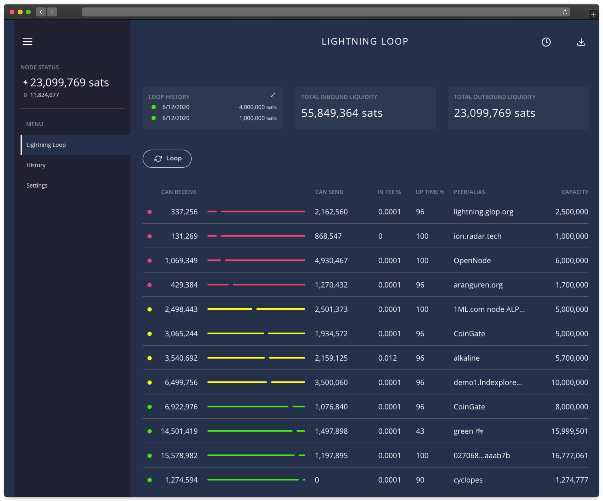

# Lightning Terminal (LiT)


Lightning Terminal (LiT) is a browser-based interface for managing channel liquidity.



## Features
- Visualize your channels and balances
- Perform submarine swaps via the [Lightning Loop](https://lightning.engineering/loop) service
- Classify channels according to your node's operating mode
- Run a single binary that integrates [`loopd`](https://github.com/lightninglabs/loop),
  [`poold`](https://github.com/lightninglabs/pool) and
  [`faraday`](https://github.com/lightninglabs/faraday) daemons all in one
- Access a preview release of the Pool UI
- Use Pool to earn sats by opening channels to those needing inbound liquidity

## Installation
Download the latest binaries from the [releases](https://github.com/lightninglabs/lightning-terminal/releases) page. 

Additionally, you can find detailed instructions on the [docs.lightning.engineering](https://docs.lightning.engineering/lightning-network-tools/lightning-terminal/get-lit) page.

## Execution
Run Lightning Terminal with a local `lnd` instance:

```shell
⛰  ./litd --uipassword=UP48lm4Vjqxy<change_this_or_you_will_get_robbed>
```

Visit https://localhost:8443 to access Terminal.

Note that a password with a minimum of 8 characters is required to run Lightning Terminal. In a production environment, it's recommended that you store this password as an environment variable to avoid it being recorded in the command history.

To use LiT with a remote `lnd` instance please [follow these instructions](./docs/config-lnd-remote.md). If you would like to replace your existing LND instance with the one integrated within LiT please see [configuring Terminal](./docs/config-lnd-integrated.md).

## LND
Note that LiT requires `lnd` to be built with **all of its subservers** and requires running at least v0.11.0. Download the latest [official release binary](https://github.com/lightningnetwork/lnd/releases/latest) or build `lnd` from source by following the [installation instructions](https://github.com/lightningnetwork/lnd/blob/master/docs/INSTALL.md). If you choose to build `lnd` from source, use the following command to enable all the relevant subservers:

```shell
⛰  make install tags="signrpc walletrpc chainrpc invoicesrpc"
```

## Interaction
If you plan to run LiT on a remote machine but access the web-interface from your computer you may not want to deal with self-signed certificate browser warnings. To avoid these warnings configure the HTTP server to use a certificate from [Let's Encrypt](https://letsencrypt.org/). View the
[Let's Encrypt Configuration](./docs/letsencrypt.md) doc for instructions on how to configure this.

## Upgrading
If you used command line arguments with previous versions then you don't need to change anything when upgrading. 

To upgrade from v0.1.1-alpha or earlier simply create a `lit.conf` file in your LiT directory. The default location LiT uses depends on your operating system:
- MacOS: `~/Library/Application Support/Lit/lit.conf`
- Linux: `~/.lit/lit.conf`
- Windows: `~/AppData/Roaming/Lit/lit.conf`

Move all the configuration settings specific to LiT from `lnd.conf` to `lit.conf` and remove any previous LiT-specific customizations from the configuration settings in `lnd.conf`. Note that any section headers (`[ Example ]`) in `lit.conf` should be removed or changed to comments (`# Example`). 

## Usage
Read the [walkthrough](docs/WALKTHROUGH.md) document to learn more about how to use LiT.

## Troubleshooting
If you encounter any issues please see our [troubleshooting guide](./docs/troubleshooting.md).

## Build from source
If you’d prefer to compile from source code please follow [these instructions](./docs/compile.md).

## Compatibility

Full Lightning Terminal functionality can be dependent on running a compatible
version of `lnd`. For each LiT release, the minimum compatible `lnd` version
should be specified in the [GitHub release
notes](https://github.com/lightninglabs/lightning-terminal/releases). If a
release note does not list it (for example, older releases), see the archived
compatibility table in [docs/compatibility.md](./docs/compatibility.md).

This compatibility requirement only applies when running LiT in remote mode
(`lnd-mode=remote`). The bundled version will always come with the correct,
[compatible versioning](#daemon-versions-packaged-with-lit).

LiT offers two main operating modes, one in which [`lnd` is running inside the
LiT process (called "lnd integrated mode", set by `lnd-mode=integrated` config
option)](docs/config-lnd-integrated.md) and one in which [`lnd` is running in
a standalone process on the same or remote machine (called "lnd remote mode",
set by `lnd-mode=remote` config option)](docs/config-lnd-remote.md).

In addition to those main modes, the individual bundled daemons (Faraday, Loop
and Pool) can be toggled to be integrated or remote as well, or as disabled.
This offers a large number of possible configuration combinations, of which not
all are fully supported due to technical reasons.

The following table shows the supported combinations:

|                                        | `lnd-mode=integrated` | `lnd-mode=remote` |
|----------------------------------------|-----------------------|-------------------|
| `faraday-mode=integrated`              | X                     | X                 |
| `loop-mode=integrated`                 | X                     | X                 |
| `pool-mode=integrated`                 | X                     | X                 |
| `taproot-assets-mode=integrated`       | X                     | X                 |
| `faraday-mode=remote`                  |                       | X                 |
| `loop-mode=remote`                     |                       | X                 |
| `pool-mode=remote`                     |                       | X                 |
| `taproot-assets-mode=remote`           |                       | X                 |
| `faraday-mode=disable`                 | X                     | X                 |
| `loop-mode=disable`                    | X                     | X                 |
| `pool-mode=disable`                    | X                     | X                 |
| `taproot-assets-mode=disable`          | X                     | X                 |
| `lnd` running in "stateless init" mode | X                     |                   |

NOTE: Taproot Assets **Channel** functionality is only available when both `lnd`
and `tapd` are running in the same process (by setting both
`lnd-mode=integrated` and `taproot-assets-mode=integrated`). Remote mode support
will be added in the future.
