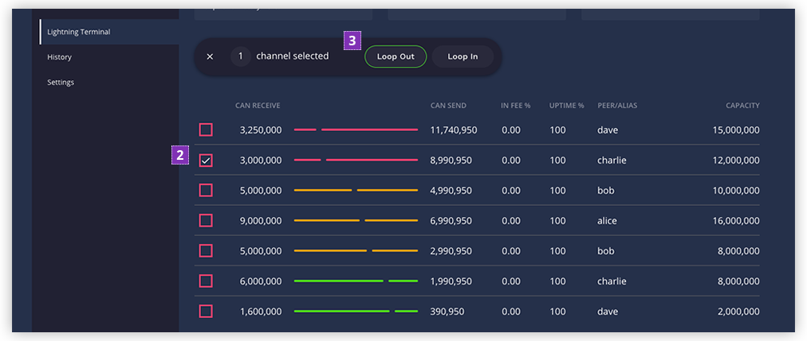
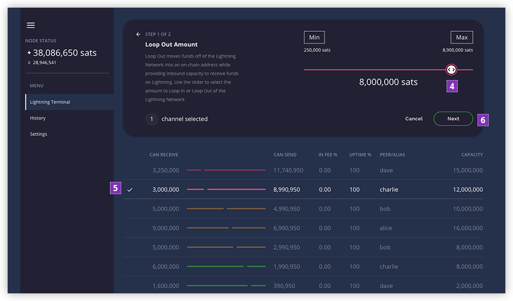
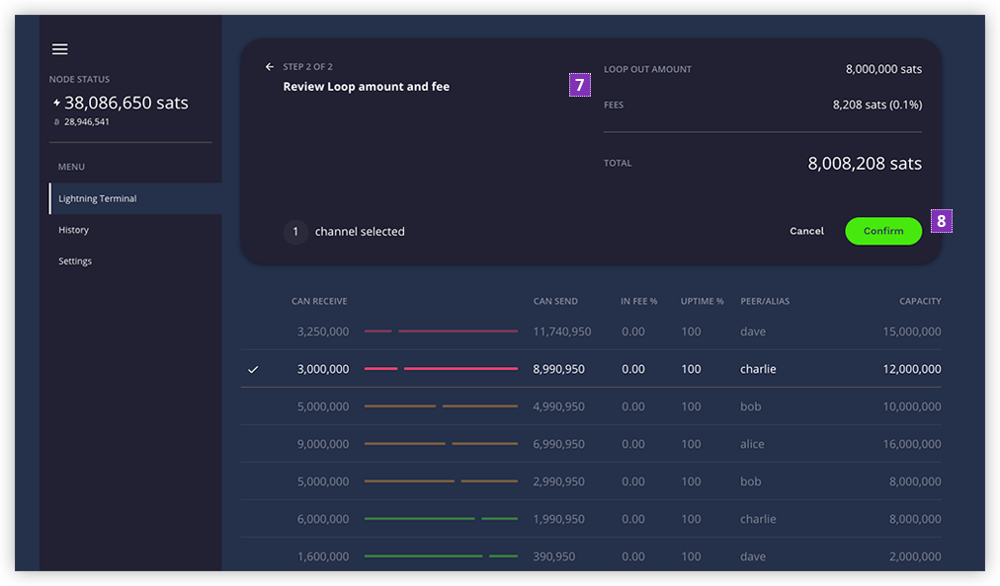
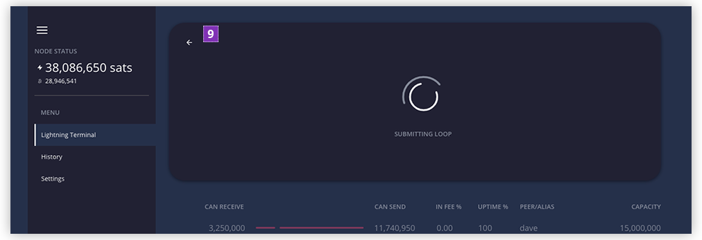
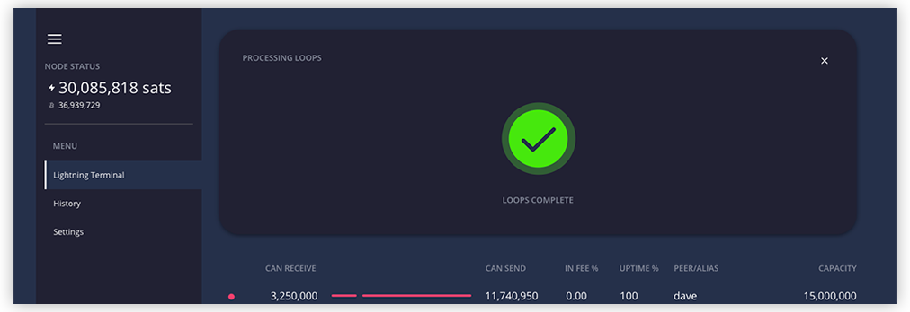
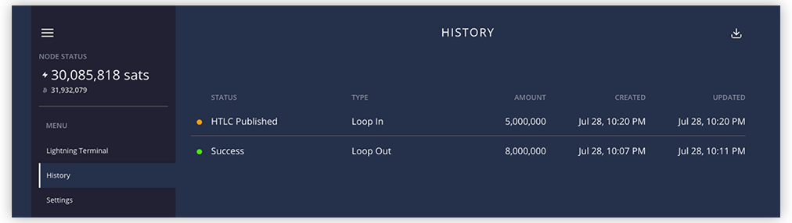

# Lightning Terminal Walkthrough

This document provides a brief overview of the information provided in Lightning Terminal
along with step-by-step instructions on how to perform a Loop via the user interface.

We assume you already have a basic understanding of the Lightning Network, LND nodes, and
channels. You should already have Lightning Terminal installed and can access the
dashboard via a web browser. Installation instructions can be found in the
[README](../README.md).

- [What is Loop](#what-is-loop)
- [Visual Overview](#visual-overview)
- [How to perform a Swap](#how-to-perform-a-swap)
- [View Loop History](#view-loop-history)
- [Manage UI Settings](#manage-ui-settings)

## What is Loop?

**Lightning Loop** is a non-custodial service offered by
[Lightning Labs](https://lightning.engineering/) to move funds in and out of the Lightning
Network from the Bitcoin blockchain. This allows you to easily alter the balances of your
channels without needing to close and reopen them, which extends the lifetime of your
channels. It also enables operations from multiple nodes to be _batched_ as well, which
reduces the fees you need to pay.

Refer to the Loop daemon
[documentation](https://github.com/lightninglabs/loop/blob/master/README.md) for a more
detailed explanation.

### Terminology

- **Loop Out**: transfer funds from the local balance of one or more Lightning channels to
  your on-chain Bitcoin wallet to...
  - acquire inbound channel liquidity from arbitrary nodes on the Lightning network
  - deposit funds to a Bitcoin on-chain address without closing active channels
  - pay to on-chain fallback addresses in the case of insufficient route liquidity
- **Loop In**: transfer funds from your on-chain Bitcoin wallet to the local balance of
  one or more of your Lightning channels to...
  - refill depleted channels with funds from cold-wallets or exchange withdrawals
  - service off-chain Lightning withdrawals using on-chain payments, with no funds in
    channels required
  - have a failsafe payment method that can be used when channel liquidity along a route
    is insufficient
- **Swap**: a single instance of a transfer between your off-chain and on-chain balances,
  which can be either a Loop Out or Loop In

## Visual Overview

Here is an overview of what is displayed on screen after you first log in to the
dashboard.

1. The confirmed balances on the Lightning Network and on-chain
1. The navigation menu containing links to the different screens

   | Page           | Description                                                              |
   | -------------- | ------------------------------------------------------------------------ |
   | Lightning Loop | displays a list of all of your channels and allows you to perform swaps  |
   | History        | displays a list of all of your past swaps                                |
   | Settings       | change settings to customize the dashboard UI as well as view node info. |

1. Click the export icon to export your channels as a CSV file
1. The amount of Bitcoin that the node can receive over your Lightning channels
1. The amount of Bitcoin that the node can send over your Lightning channels
1. Click the Loop button to begin creating a swap
1. The list of open channels that the node has with other peers on the Lightning Network

   | Column Name | Description                                                                                                                                                                                            |
   | ----------- | ------------------------------------------------------------------------------------------------------------------------------------------------------------------------------------------------------ |
   | Can Receive | the amount that can be received over the channel                                                                                                                                                       |
   | Balance Bar | a visual representation of how much of the channel balance can be sent vs received                                                                                                                     |
   | Can Send    | the amount that can be sent over this channel                                                                                                                                                          |
   | In Fee %    | the routing fee rate charged by the peer to receive payments over the channel. The percent is rounded to two decimal places. Hover over the value to see the exact rate expressed as parts-per-million |
   | Up Time %   | the uptime percentage of the channel peer                                                                                                                                                              |
   | Peer/Alias  | the alias of the channel peer. Hover over this field to see the peer's pubkey                                                                                                                          |
   | Capacity    | the total capacity of the channel                                                                                                                                                                      |

Lightning Terminal uses a traffic light system to help you prioritize your actions.

| Color         | Meaning                                                                              |
| ------------- | ------------------------------------------------------------------------------------ |
| Red/Pink      | highlights information that needs your immediate attention or a failure has occurred |
| Yellow/Orange | highlights information that you should attend to soon                                |
| Green         | should tell you that all is well, and no extra attention is required                 |

## How to perform a Swap

Follow the steps below to perform a swap via the Lightning Terminal.

1. Click on the **Loop** button to begin

2. (Optional) Select one or more channels if you want the swap to only transfer funds over
   the chosen channels. This is helpful if you want to only adjust the balance of specific
   channels.

   If you choose more than one channel, there's no guarantee how funds will be split
   amongst the channels. `lnd` will use its knowledge of the network to determine how best
   to split up the payment, if necessary. It's possible that only one of the channels will
   be used if the payment can be successfully routed through a single channel.

   If no channels are specified, Lightning Loop will automatically select channels
   according to its own optimization algorithm.

3. Click on either the **Loop Out** or **Loop In** buttons depending on whether you want
   to transfer funds in or out of the Lightning Network.

   > We'll click **Loop Out** in this walk through

4. Drag the slider to adjust the amount you want to swap. The Loop server will vary the
   maximum you can swap based on the terms set by Lightning Labs as well as by the amount
   you have available in your channels.
5. Confirm the selected channels that will be used, if any were chosen.
6. Click the **Next** button.

7. Review the Loop amount and the fee. Keep in mind that you will only be charged the fee.
   The Loop amount will remain on your node once the swap completes. The balance will just
   be shifted between your on-chain and Lightning balances.
8. Click the **Confirm** button to submit the swap information to the server and begin the
   Loop process.

You will see a loading animation for a few seconds while the information is being
submitted.

9. (Optional) If you wish to abort the swap, you can click on the back arrow button before
   the loading animation goes away in 3-5 seconds.

10. Your swap will now be displayed in the **Processing Loops** section. It shows you the
    swap id, amount, and current status as a progress bar.

    Swaps require on-chain transactions, so you will need to wait for confirmations before
    they will complete successfully. For more detailed information about the swap process,
    take a look at the
    [Loop Out In-depth](https://lightning.engineering/posts/2019-04-15-loop-out-in-depth/)
    blog post.

11. If you selected a channel, it will be indicated with arrows to remind you that there
    is currently a pending swap using the channel.

    > Notice that the local balance of this channel dropped by ~8,000,000 sats

12. To close the **Processing Loops** section while waiting for on-chain confirmations,
    click on the **Close** icon.

You may perform more than one swap at a time, as long as you have the available funds.

13. To re-open the **Processing Loop** section after closing it, click on the **Maximize**
    icon.

Once all swaps are complete, the green check icon is displayed in the **Processing Loop**
section

> Notice that the node's Lightning balance decreased by ~8,000,000 sats and the on-chain
> wallet balance increased by roughly the same amount.

Congratulations! We have just successfully completed our first **Loop Out**.

## View Loop History

The **Loop History** page displays a chronological list of all the swaps that have been
executed by your node.

## Manage UI Settings

The **Settings** page allows you to configure UI settings and view some basic node
information.

> Note: settings are currently stored in the browser and therefore will not persist across
> multiple devices

### Bitcoin Unit

Change the unit of Bitcoin values displayed throughout the website.

| Unit     | 1 Unit (in BTC) | Displayed As      |
| -------- | --------------- | ----------------- |
| Satoshis | 0.00000001 BTC  | 123,456,789 sats  |
| Bits     | 0.00000100 BTC  | 1,234,567.89 bits |
| Bitcoin  | 1.00000000 BTC  | 1.23456789 BTC    |

### Channel Balance Mode

This setting determines how channels are colored and sorted on the **Loop** page according
to your node's operating mode.

Below are the same list of channels viewed using the different **Channel Balance Mode**
options.

**Optimize for Receiving**: For merchants who primarily receive inbound Lightning
payments, the channels with high local balances will be shaded red. The goal is to keep
your local balances as low as possible, so that you can receive more funds inbound.

**Optimize for Sending**: For exchanges, fiat gateways, and other operators who primarily
send outgoing Lightning payments, the channels with high local balances will be shaded
red. The goal is to keep your local balances as high as possible, so that you can send
more funds outbound.

**Optimize for Routing**: For routing node operators, that want to keep their channels
balanced close to 50%, the channels with a high balance in either direction will be
flagged.
