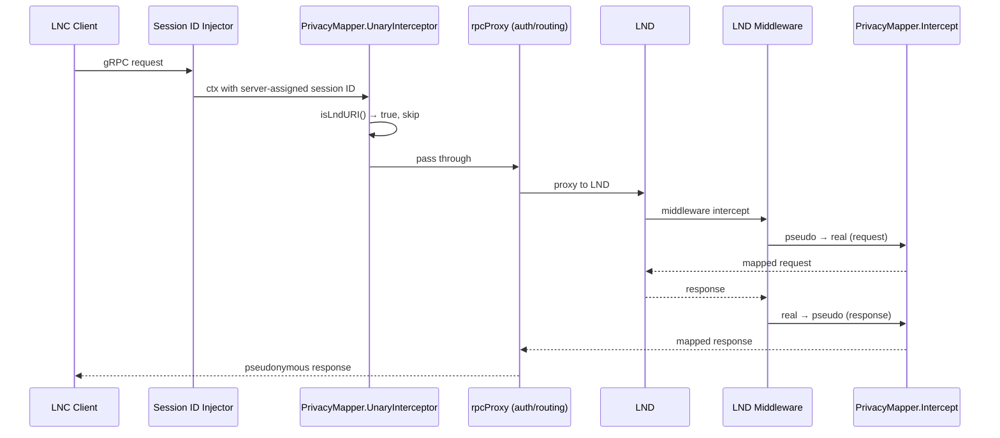
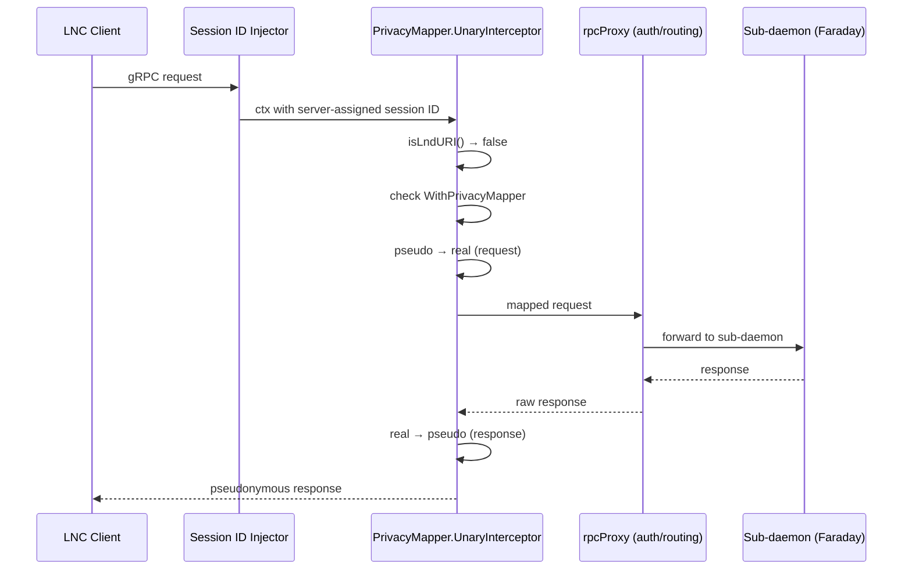

# Privacy Mapping Call Flows

The privacy mapper translates real network identifiers (pubkeys, channel
IDs, amounts) into pseudonymous values for LNC sessions, so a session
operator can interact with node data without learning the host's actual
topology. LiT applies this mapping at two different layers depending on
which service the request targets; the diagrams below contrast the two
flows.

## LND Requests (e.g. `/lnrpc.Lightning/GetInfo`)

LND calls are proxied through to LND, which applies privacy mapping via
its own middleware chain (`PrivacyMapper.Intercept`). The LNC interceptor
detects LND URIs and passes them through without mapping.

## Sub-daemon Requests (e.g. `/frdrpc.FaradayServer/RevenueReport`)

Non-LND calls are privacy-mapped at the gRPC interceptor level before
reaching the sub-daemon. The interceptor checks the session's
`WithPrivacyMapper` flag and applies request/response mapping inline.

